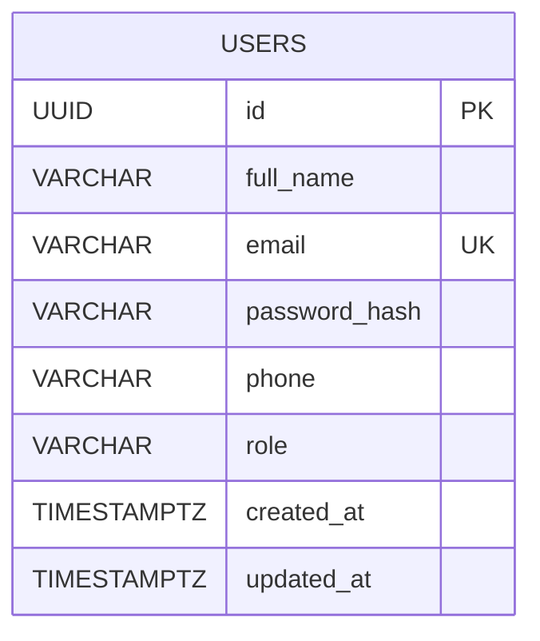
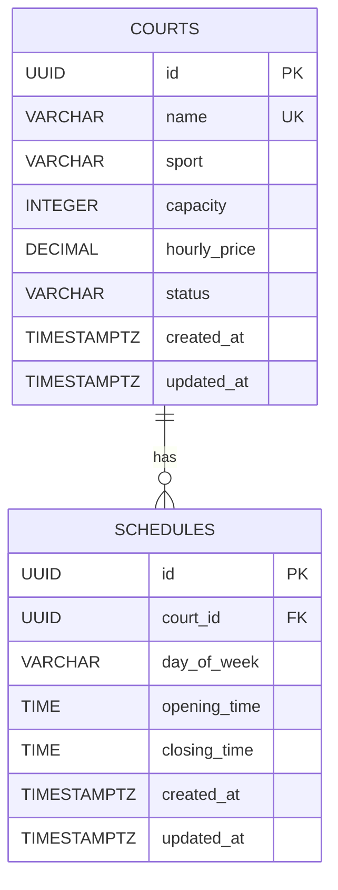
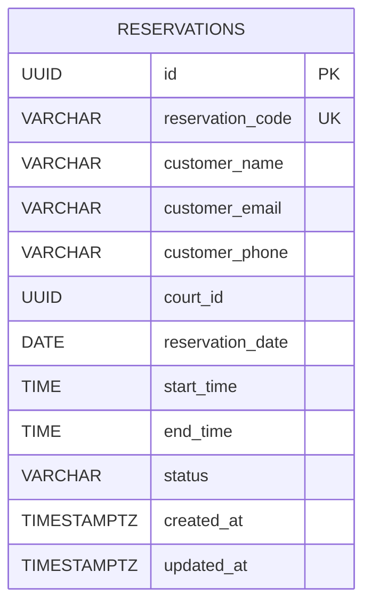
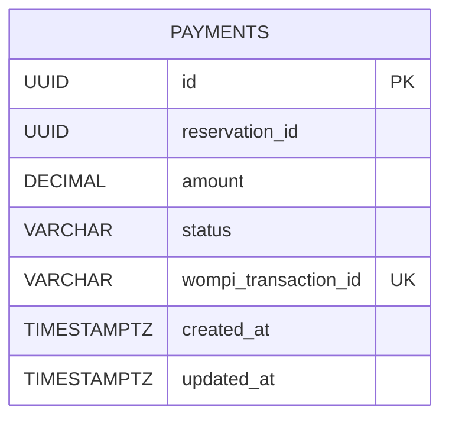

# Data Models per Service

> Futbolix follows the **Database per Service** principle. Each microservice owns its
> own PostgreSQL database and is responsible for the data within its bounded context.
> Services never access another service's database directly.

---

## Data modeling principles

### 1. Database per Service

Each Futbolix microservice owns an independent PostgreSQL database:

```text
user-service
    └── user_db

court-service
    └── court_db

reservation-service
    └── reservation_db

payment-service
    └── payment_db
```

Each service owns and manages only its own data.

No service is allowed to directly access another service's database.

If information from another service is required, the service must use an API
request or an asynchronous event through RabbitMQ.

---

### 2. Standard audit fields

The project uses standard audit timestamps across the data model.

```sql
id          UUID        PRIMARY KEY DEFAULT gen_random_uuid(),
created_at  TIMESTAMPTZ NOT NULL     DEFAULT NOW(),
updated_at  TIMESTAMPTZ NOT NULL     DEFAULT NOW()
```

UUIDs are used as primary identifiers across services.

`TIMESTAMPTZ` is used for timestamps to preserve timezone information.

---

### 3. Data retention

Futbolix prioritizes the preservation of reservation and payment history.

Historical reservation and payment records must remain available because
reservation history is part of the MVP.

Physical deletion of historical business records should not be used unless
explicitly required by a business or legal rule.

---

### 4. Naming conventions

| Element | Convention | Example |
|---------|------------|---------|
| Tables | snake_case, plural | `users`, `courts`, `reservations` |
| Columns | snake_case | `full_name`, `hourly_price` |
| Primary keys | UUID | `id` |
| Cross-service references | UUID without FK constraint | `court_id`, `reservation_id` |
| Timestamps | TIMESTAMPTZ | `created_at` |
| Money | DECIMAL(12,2) + CHAR(3) currency | `hourly_price`, `amount`, `currency` |
| Status fields | VARCHAR + CHECK | `ACTIVE`, `CONFIRMED` |

---

## Data ownership

Each service is the single owner of its own business data.

| Data | Owner Service |
|------|---------------|
| Administrator accounts | user-service |
| Administrator credentials | user-service |
| Administrator roles | user-service |
| Four fixed courts | court-service |
| Court schedules | court-service |
| Court prices | court-service |
| Court status | court-service |
| Reservations | reservation-service |
| Customer contact information for reservations | reservation-service |
| Payment records | payment-service |
| Wompi Sandbox transaction references | payment-service |

There are no shared tables between services.

---

# Service: user-service

**Database:** `user_db`

**DB Engine:** PostgreSQL 15

**Engine justification:** PostgreSQL provides relational consistency, ACID
transactions, constraints and indexes required for administrator authentication
and role management.

Customers do not create accounts in Futbolix. Customer authentication and
customer accounts are outside the MVP.

Therefore, `user-service` stores **administrator accounts only**.

---

## Table: users

**Purpose:** Stores administrator accounts used to access protected Futbolix
administration functionality.

```sql
CREATE TABLE users (
    id              UUID PRIMARY KEY DEFAULT gen_random_uuid(),

    full_name       VARCHAR(150) NOT NULL,
    email           VARCHAR(255) NOT NULL,
    password_hash   VARCHAR(255) NOT NULL,
    phone           VARCHAR(30),

    role            VARCHAR(30) NOT NULL DEFAULT 'ADMINISTRATOR'
                    CHECK (role IN ('ADMINISTRATOR')),

    created_at      TIMESTAMPTZ NOT NULL DEFAULT NOW(),
    updated_at      TIMESTAMPTZ NOT NULL DEFAULT NOW()
);

CREATE UNIQUE INDEX idx_users_email
    ON users (email);
```

### Fields

| Field | Type | Nullable | Description | Constraints |
|-------|------|----------|-------------|-------------|
| `id` | UUID | No | Unique administrator identifier | PK |
| `full_name` | VARCHAR(150) | No | Administrator's full name | NOT NULL |
| `email` | VARCHAR(255) | No | Administrator login email | UNIQUE |
| `password_hash` | VARCHAR(255) | No | Securely hashed administrator password | NOT NULL |
| `phone` | VARCHAR(30) | Yes | Administrator contact number | Optional |
| `role` | VARCHAR(30) | No | Authorization role | ADMINISTRATOR |
| `created_at` | TIMESTAMPTZ | No | Account creation timestamp | NOT NULL |
| `updated_at` | TIMESTAMPTZ | No | Last update timestamp | NOT NULL |

### Modeling decisions

1. Only the `ADMINISTRATOR` role is stored in the MVP.
2. Customers are anonymous and do not have accounts.
3. Customer information is therefore not stored in `user-service`.
4. Passwords are never stored in plain text.
5. `password_hash` stores only the result of the configured password hashing
   mechanism.
6. Administrator email addresses must be unique.

### ER diagram



---

# Service: court-service

**Database:** `court_db`

**DB Engine:** PostgreSQL 15

**Engine justification:** Court information is structured relational data.
PostgreSQL provides constraints, indexes and relationships required to maintain
consistent court configuration and schedules.

Futbolix manages **exactly four fixed football courts** in the MVP.

The four courts are created through Flyway seed migrations.

There is no API endpoint for creating or deleting courts.

---

## Table: courts

**Purpose:** Stores the four fixed football courts managed by Futbolix.

```sql
CREATE TABLE courts (
    id              UUID PRIMARY KEY DEFAULT gen_random_uuid(),

    name            VARCHAR(100) NOT NULL,
    sport           VARCHAR(50) NOT NULL DEFAULT 'FOOTBALL',
    capacity        INTEGER NOT NULL CHECK (capacity > 0),

    hourly_price    DECIMAL(10,2) NOT NULL
                    CHECK (hourly_price > 0),

    status          VARCHAR(30) NOT NULL DEFAULT 'ACTIVE'
                    CHECK (
                        status IN (
                            'ACTIVE',
                            'INACTIVE',
                            'UNDER_MAINTENANCE'
                        )
                    ),

    created_at      TIMESTAMPTZ NOT NULL DEFAULT NOW(),
    updated_at      TIMESTAMPTZ NOT NULL DEFAULT NOW()
);

CREATE UNIQUE INDEX idx_courts_name
    ON courts (name);

CREATE INDEX idx_courts_status
    ON courts (status);
```

### Fields

| Field | Type | Nullable | Description | Constraints |
|-------|------|----------|-------------|-------------|
| `id` | UUID | No | Unique court identifier | PK |
| `name` | VARCHAR(100) | No | Court name | UNIQUE |
| `sport` | VARCHAR(50) | No | Sport offered by the court | FOOTBALL |
| `capacity` | INTEGER | No | Maximum number of players | > 0 |
| `hourly_price` | DECIMAL(10,2) | No | Price per reservation hour | > 0 |
| `status` | VARCHAR(30) | No | Operational court status | ACTIVE, INACTIVE, UNDER_MAINTENANCE |
| `created_at` | TIMESTAMPTZ | No | Creation timestamp | NOT NULL |
| `updated_at` | TIMESTAMPTZ | No | Last update timestamp | NOT NULL |

---

## Table: schedules

**Purpose:** Stores the opening and closing hours for each fixed court.

```sql
CREATE TABLE schedules (
    id              UUID PRIMARY KEY DEFAULT gen_random_uuid(),

    court_id        UUID NOT NULL
                    REFERENCES courts(id)
                    ON DELETE CASCADE,

    day_of_week     VARCHAR(10) NOT NULL
                    CHECK (
                        day_of_week IN (
                            'MON',
                            'TUE',
                            'WED',
                            'THU',
                            'FRI',
                            'SAT',
                            'SUN'
                        )
                    ),

    opening_time    TIME NOT NULL,
    closing_time    TIME NOT NULL,

    created_at      TIMESTAMPTZ NOT NULL DEFAULT NOW(),
    updated_at      TIMESTAMPTZ NOT NULL DEFAULT NOW(),

    CONSTRAINT chk_schedule_hours
        CHECK (closing_time > opening_time)
);

CREATE INDEX idx_schedules_court_id
    ON schedules (court_id);

CREATE UNIQUE INDEX idx_schedules_court_day
    ON schedules (court_id, day_of_week);
```

### Fields

| Field | Type | Nullable | Description | Constraints |
|-------|------|----------|-------------|-------------|
| `id` | UUID | No | Schedule identifier | PK |
| `court_id` | UUID | No | Court associated with the schedule | FK → courts.id |
| `day_of_week` | VARCHAR(10) | No | Day to which the schedule applies | Valid day |
| `opening_time` | TIME | No | Court opening time | NOT NULL |
| `closing_time` | TIME | No | Court closing time | > opening_time |
| `created_at` | TIMESTAMPTZ | No | Creation timestamp | NOT NULL |
| `updated_at` | TIMESTAMPTZ | No | Last update timestamp | NOT NULL |

### Modeling decisions

1. `schedules.court_id` uses a real foreign key because both tables belong to
   `court-service`.
2. A court cannot have more than one schedule for the same day.
3. `hourly_price` uses `DECIMAL` instead of `FLOAT` because it represents money.
4. The four courts are seeded through Flyway.
5. The API does not provide endpoints to create or delete courts.

### ER diagram



---

# Service: reservation-service

**Database:** `reservation_db`

**DB Engine:** PostgreSQL 15

**Engine justification:** Reservations are the core transactional data of
Futbolix. PostgreSQL provides transactions, constraints and indexes required
to maintain reservation consistency and prevent double bookings.

Customers are anonymous in Futbolix.

Therefore, reservation data stores the customer's contact information directly
instead of referencing a customer account in `user-service`.

---

## Table: reservations

**Purpose:** Stores reservation requests and their lifecycle.

```sql
CREATE TABLE reservations (
    id                  UUID PRIMARY KEY DEFAULT gen_random_uuid(),

    reservation_code    VARCHAR(20) NOT NULL,

    customer_name       VARCHAR(150) NOT NULL,
    customer_email      VARCHAR(255) NOT NULL,
    customer_phone      VARCHAR(30) NOT NULL,

    court_id            UUID NOT NULL,

    reservation_date    DATE NOT NULL,
    start_time          TIME NOT NULL,
    end_time            TIME NOT NULL,

    status              VARCHAR(20) NOT NULL DEFAULT 'PENDING'
                        CHECK (
                            status IN (
                                'PENDING',
                                'CONFIRMED',
                                'CANCELLED',
                                'REJECTED'
                            )
                        ),

    amount              DECIMAL(12,2) NOT NULL
                        CHECK (amount > 0),
    currency            CHAR(3) NOT NULL DEFAULT 'COP',

    created_at          TIMESTAMPTZ NOT NULL DEFAULT NOW(),
    updated_at          TIMESTAMPTZ NOT NULL DEFAULT NOW(),

    CONSTRAINT chk_reservation_time
        CHECK (end_time > start_time),

    -- A reservation covers a whole number of hours.
    -- 01-context/scope.md, assumption 9.
    CONSTRAINT chk_reservation_whole_hours
        CHECK (EXTRACT(EPOCH FROM (end_time - start_time))::int % 3600 = 0)
);

CREATE UNIQUE INDEX idx_reservations_code
    ON reservations (reservation_code);

CREATE INDEX idx_reservations_court_date
    ON reservations (
        court_id,
        reservation_date,
        start_time,
        end_time
    );

CREATE INDEX idx_reservations_customer_email
    ON reservations (customer_email);

CREATE INDEX idx_reservations_status
    ON reservations (status);
```

### Fields

| Field | Type | Nullable | Description | Constraints |
|-------|------|----------|-------------|-------------|
| `id` | UUID | No | Unique reservation identifier | PK |
| `reservation_code` | VARCHAR(20) | No | Human-readable reservation code | UNIQUE |
| `customer_name` | VARCHAR(150) | No | Name provided by the anonymous customer | NOT NULL |
| `customer_email` | VARCHAR(255) | No | Customer email | NOT NULL |
| `customer_phone` | VARCHAR(30) | No | Customer phone number | NOT NULL |
| `court_id` | UUID | No | Identifier of the reserved court | Cross-service reference |
| `reservation_date` | DATE | No | Date of the reservation | NOT NULL |
| `start_time` | TIME | No | Reservation start time | NOT NULL |
| `end_time` | TIME | No | Reservation end time | > start_time |
| `status` | VARCHAR(20) | No | Current reservation state | PENDING, CONFIRMED, CANCELLED, REJECTED |
| `created_at` | TIMESTAMPTZ | No | Creation timestamp | NOT NULL |
| `updated_at` | TIMESTAMPTZ | No | Last update timestamp | NOT NULL |

---

## Cross-service reference: court_id

`court_id` belongs to `court-service`.

Therefore:

```text
reservation-service.reservations.court_id
                    │
                    └──> court-service.courts.id
```

There is **no database foreign key** because the tables belong to different
microservices and different databases.

The reservation service validates that the court exists and is available
through the appropriate service communication mechanism.

---

## Customer data

Customers do not create accounts in Futbolix.

The reservation therefore stores:

```text
customer_name
customer_email
customer_phone
```

This information belongs to `reservation-service` because it is part of the
reservation business process.

This also allows reservation history and reservation lookup to work without
requiring customer authentication.

---

## Double-booking prevention

The main business rule of the reservation database is:

> Two active reservations cannot overlap on the same court and date.

**This rule is enforced by the database engine, not by application code.** Two concurrent
requests both pass any check written in the service and both write; only the database can
arbitrate the race. This is architectural principle P5 in `05-architecture/overview.md`, and it
is one of the reasons PostgreSQL was chosen in
`05-architecture/decisions/records/ADR-008-technology-stack.md`.

The enforcement mechanism is an **exclusion constraint** over a time range:

```sql
-- Created once per database, in db/init
CREATE EXTENSION IF NOT EXISTS btree_gist;

-- Materialised range, generated so it can never drift from start_time / end_time
ALTER TABLE reservations
    ADD COLUMN period TSRANGE GENERATED ALWAYS AS (
        tsrange(reservation_date + start_time,
                reservation_date + end_time, '[)')
    ) STORED;

ALTER TABLE reservations
    ADD CONSTRAINT reservations_no_double_booking
    EXCLUDE USING gist (
        court_id WITH =,
        period   WITH &&
    )
    WHERE (status IN ('PENDING', 'CONFIRMED'));
```

How to read it: `&&` is range overlap. The constraint rejects any row whose court and time range
collide with an existing one. The `WHERE` clause means a CANCELLED or REJECTED reservation frees
its slot automatically, with no cleanup job.

The losing transaction receives SQLSTATE **`23P01`** (`exclusion_violation`). The persistence
adapter translates it into the domain exception `SlotAlreadyTakenException`, which the REST layer
returns as **HTTP 409** with code `RESERVATION_SLOT_UNAVAILABLE`. The screen that renders it is
`/booking/failed` in `12-ux-ui/navigation-map.md`.

The application still checks availability before writing, so the customer normally sees free
slots only. That check is a user-experience optimisation, **not** the guarantee.

The following index supports the availability query efficiently:

```text
idx_reservations_court_date
```

> **Verification:** this rule cannot be proven with a unit test, because it is a race. It
> requires an integration test with Testcontainers firing concurrent requests at a real
> PostgreSQL instance and asserting that exactly one reservation survives. Removing the
> constraint must make that test fail; if it still passes, the test is wrong.

### ER diagram



> `court_id` is a cross-service reference and therefore is not represented as
> a database foreign key in this service.

---

# Service: payment-service

**Database:** `payment_db`

**DB Engine:** PostgreSQL 15

**Engine justification:** Payment information requires reliable transactional
behavior, consistent status changes and protection against duplicated
transactions. PostgreSQL provides ACID transactions, constraints and indexes
appropriate for payment records.

Futbolix uses **Wompi Sandbox** for payment processing during the academic MVP.

Production/live payment processing is outside the MVP scope.

---

## Table: payments

**Purpose:** Stores payment records associated with reservations and their
Wompi Sandbox transaction references.

```sql
CREATE TABLE payments (
    id                    UUID PRIMARY KEY DEFAULT gen_random_uuid(),

    reservation_id        UUID NOT NULL,

    amount                DECIMAL(12,2) NOT NULL
                          CHECK (amount > 0),
    currency              CHAR(3) NOT NULL DEFAULT 'COP',

    status                VARCHAR(20) NOT NULL DEFAULT 'PENDING'
                          CHECK (
                              status IN (
                                  'PENDING',
                                  'APPROVED',
                                  'REJECTED',
                                  'REFUNDED'
                              )
                          ),

    wompi_transaction_id  VARCHAR(100),

    created_at            TIMESTAMPTZ NOT NULL DEFAULT NOW(),
    updated_at            TIMESTAMPTZ NOT NULL DEFAULT NOW()
);

CREATE INDEX idx_payments_reservation_id
    ON payments (reservation_id);

CREATE UNIQUE INDEX idx_payments_wompi_transaction
    ON payments (wompi_transaction_id)
    WHERE wompi_transaction_id IS NOT NULL;
```

### Fields

| Field | Type | Nullable | Description | Constraints |
|-------|------|----------|-------------|-------------|
| `id` | UUID | No | Unique payment identifier | PK |
| `reservation_id` | UUID | No | Reservation associated with the payment | Cross-service reference |
| `amount` | DECIMAL(12,2) | No | Payment amount | > 0 |
| `currency` | CHAR(3) | No | Currency, fixed to COP | DEFAULT 'COP' |
| `status` | VARCHAR(20) | No | Current payment state | PENDING, APPROVED, REJECTED, REFUNDED |
| `wompi_transaction_id` | VARCHAR(100) | Yes | Transaction identifier returned by Wompi Sandbox | UNIQUE when present |
| `created_at` | TIMESTAMPTZ | No | Payment creation timestamp | NOT NULL |
| `updated_at` | TIMESTAMPTZ | No | Last update timestamp | NOT NULL |

---

## Cross-service reference: reservation_id

`reservation_id` belongs to `reservation-service`.

Therefore:

```text
payment-service.payments.reservation_id
                    │
                    └──> reservation-service.reservations.id
```

There is no database foreign-key constraint because the reservation and
payment databases are independent.

---

## Wompi Sandbox payment lifecycle

The payment lifecycle is:

```text
PENDING
   │
   ├── Wompi Sandbox approves
   │          │
   │          └──> APPROVED
   │
   └── Wompi Sandbox rejects
              │
              └──> REJECTED
```

If an applicable refund is processed:

```text
APPROVED
    │
    └──> REFUNDED
```

---

## Idempotency

Wompi Sandbox payment notifications may be delivered more than once.

The unique index on:

```text
wompi_transaction_id
```

prevents the same Wompi transaction from being recorded multiple times.

Payment event consumers must also be idempotent according to the project's
RabbitMQ at-least-once delivery policy.

### ER diagram



> `reservation_id` is a cross-service reference and therefore is not
> represented as a database foreign key in this service.

---

# Cross-service data relationships

Futbolix intentionally does not use database-level foreign keys between
microservices.

The logical relationships are:

```text
┌─────────────────────────┐
│      user-service       │
│        user_db          │
│                         │
│ users                   │
│ - id                    │
│ - email                 │
│ - password_hash         │
│ - role                  │
└─────────────────────────┘


┌─────────────────────────┐
│      court-service      │
│        court_db         │
│                         │
│ courts                  │
│ schedules               │
└────────────┬────────────┘
             │
             │ court_id
             ▼
┌──────────────────────────────┐
│     reservation-service      │
│       reservation_db         │
│                              │
│ reservations                 │
│ - customer_name              │
│ - customer_email             │
│ - customer_phone             │
│ - court_id                   │
└──────────────┬───────────────┘
               │
               │ reservation_id
               ▼
┌──────────────────────────────┐
│       payment-service        │
│          payment_db          │
│                              │
│ payments                     │
│ - reservation_id             │
│ - amount                     │
│ - status                     │
│ - wompi_transaction_id       │
└──────────────────────────────┘
```

These are logical references and not database foreign keys.

---

# Data consistency between services

Futbolix uses synchronous API communication and asynchronous RabbitMQ events
instead of shared databases.

A simplified reservation and payment flow is:

```text
Customer
   │
   ▼
reservation-service
   │
   │ ReservationCreated
   ▼
RabbitMQ
   │
   ▼
payment-service
   │
   ▼
Wompi Sandbox
   │
   ├── Approved
   │       │
   │       └── PaymentApproved
   │
   └── Rejected
           │
           └── PaymentRejected
```

RabbitMQ provides asynchronous communication between the services.

Because RabbitMQ uses at-least-once delivery, event consumers must be
idempotent.

Services must not depend on distributed database transactions.

---

# Intentional denormalization

Futbolix intentionally stores customer contact information in
`reservation-service`:

```text
customer_name
customer_email
customer_phone
```

This is intentional because customers are anonymous and do not have accounts
in `user-service`.

The reservation owns the contact information required for its own business
process.

This avoids introducing a customer-account dependency that is not part of the
Futbolix MVP.

---

# Normalization considerations

The data model follows relational normalization principles.

### User data

Administrator information is stored in one `users` table because the MVP only
requires one administrator role.

### Court data

Court information and schedule information are separated into:

```text
courts
schedules
```

This avoids repeating court information for every schedule entry.

### Reservation data

Customer contact information is stored with the reservation because customers
are anonymous and the contact information belongs to the reservation process.

### Payment data

Payment records are separated from reservations because payment information
belongs to the `payment-service` bounded context and must remain independently
owned.

---

# Migration strategy

**Migration tool:** Flyway

Each microservice maintains its own Flyway migration history.

Example structure:

```text
user-service
└── db/migration
    ├── V001__create_users_table.sql
    └── V002__add_user_constraints.sql

court-service
└── db/migration
    ├── V001__create_courts_table.sql
    ├── V002__create_schedules_table.sql
    └── V003__seed_four_courts.sql

reservation-service
└── db/migration
    └── V001__create_reservations_table.sql

payment-service
└── db/migration
    └── V001__create_payments_table.sql
```

Each service has its own `flyway_schema_history` table.

---

## Migration naming convention

```text
V{version}__{snake_case_description}.sql
```

Examples:

```text
V001__create_users_table.sql
V001__create_courts_table.sql
V002__create_schedules_table.sql
V003__seed_four_courts.sql
V001__create_reservations_table.sql
V001__create_payments_table.sql
```

---

## Migration rules

```text
✓ Every database schema change must be represented by a Flyway migration.
✓ Migrations are versioned.
✓ Each service has its own migration history.
✓ Migrations must work in a clean database.
✓ A migration that has already been executed must not be edited.
✓ New changes require a new migration.
✓ Cross-service database migrations are never used.
✓ Database ownership remains inside the corresponding microservice.
```

---

# Four fixed courts

The MVP requires exactly four football courts.

They are created through a Flyway seed migration in `court-service`.

Example:

```text
V003__seed_four_courts.sql
```

The migration inserts the four predefined courts required by the MVP.

The API does not provide endpoints for creating or deleting courts.

Administrators can manage the configuration of the existing courts according
to the project rules.

---

# Important data constraints

The following constraints are part of the Futbolix data model:

1. Futbolix has exactly four fixed courts in the MVP.
2. The four courts are seeded through Flyway.
3. Courts cannot be created or deleted through the API.
4. Customers do not have accounts.
5. Only administrators are stored in `user-service`.
6. Reservations store anonymous customer contact information.
7. `court_id` is a cross-service reference without a foreign key.
8. `reservation_id` is a cross-service reference without a foreign key.
9. Two active reservations cannot overlap on the same court and date.
10. Payment records are owned exclusively by `payment-service`.
11. Wompi transaction references are unique when present.
12. Wompi Sandbox is used for the academic MVP.
13. Production/live payment processing is outside the MVP.
14. Services never access another service's database directly.
15. Database schema changes are managed through Flyway.
16. PostgreSQL is the database engine used by all Futbolix microservices.

---

# Correlations

- Domain entities that map to these tables → `02-domain/entities-and-rules.md`
- Domain events related to reservations and payments → `02-domain/domain-events.md`
- Database ownership rules → `00-governance/microservices-documentation.md`
- Security requirements for administrator credentials → `00-governance/security-rules.md`
- Wompi Sandbox payment controls → `00-governance/security-policy.md`
- System scope and MVP boundaries → `01-context/scope.md`
- System architecture and technology decisions → `01-context/overview.md`
- Detailed service data models → `09-microservices/services/[service]/data-model.md`

---

# Data model summary

```text
                    FUTBOLIX DATA MODEL

┌──────────────────────┐
│    USER SERVICE      │
│      user_db         │
│                      │
│       USERS          │
│                      │
│ Administrators only  │
└──────────────────────┘


┌──────────────────────┐
│    COURT SERVICE     │
│      court_db        │
│                      │
│       COURTS         │
│          │           │
│          ▼           │
│      SCHEDULES       │
│                      │
│    Exactly 4 courts  │
└──────────┬───────────┘
           │
           │ court_id
           ▼
┌──────────────────────────────┐
│     RESERVATION SERVICE      │
│       reservation_db         │
│                              │
│       RESERVATIONS           │
│                              │
│ Anonymous customer data      │
│ Double-booking prevention    │
└──────────────┬───────────────┘
               │
               │ reservation_id
               ▼
┌──────────────────────────────┐
│       PAYMENT SERVICE        │
│          payment_db          │
│                              │
│          PAYMENTS            │
│                              │
│       Wompi Sandbox         │
└──────────────────────────────┘
```

This model keeps each microservice independent while preserving the
relationships required by Futbolix through APIs and RabbitMQ events instead
of shared database access.

---

## Idempotency — `processed_events`

Present in the **reservation** and **payment** schemas.

RabbitMQ delivers at-least-once, so a consumer can receive the same event twice. Every consumer
records the `eventId` it has already handled and ignores repeats. This is required by
`02-domain/domain-events.md` and is a Definition of Done criterion.

```sql
CREATE TABLE processed_events (
    event_id     UUID PRIMARY KEY,
    event_type   VARCHAR(100) NOT NULL,
    processed_at TIMESTAMPTZ  NOT NULL DEFAULT NOW()
);
```

**Why the primary key matters.** The check and the write share one transaction. If two
deliveries are handled concurrently, the second insert violates the primary key and its
transaction rolls back. The `SELECT` performed before processing is an optimisation; the
primary key is the guarantee. Same reasoning as the exclusion constraint above.
